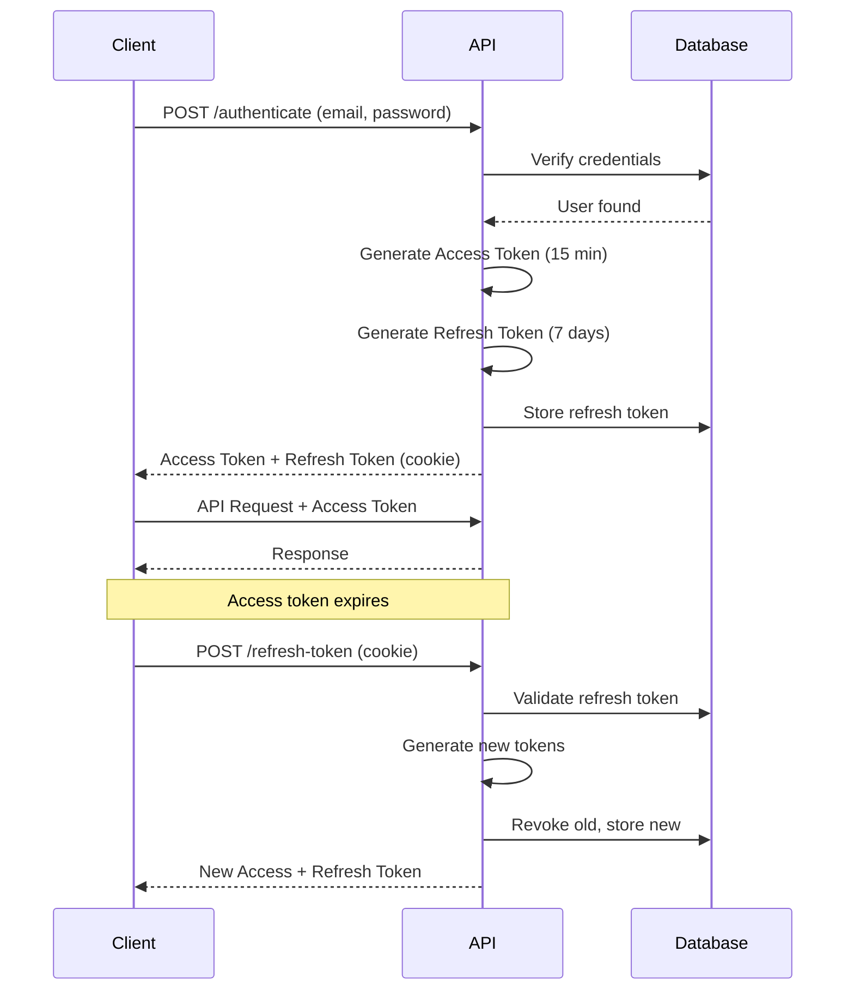

# Project Management Platform API

[](https://dotnet.microsoft.com/)
[](https://docs.microsoft.com/en-us/dotnet/csharp/)
[](LICENSE)
[]()

> **Production-ready ASP.NET Core Web API** demonstrating enterprise-grade backend development with JWT authentication, refresh tokens, role-based authorization, and clean architecture.

---

## ?? Table of Contents

- [Overview](#overview)
- [Features](#features)
- [Tech Stack](#tech-stack)
- [Architecture](#architecture)
- [Getting Started](#getting-started)
- [API Documentation](#api-documentation)
- [Security](#security)
- [Testing](#testing)
- [Documentation](#documentation)
- [Contributing](#contributing)
- [License](#license)

---

## ?? Overview

This project is a **real-world SaaS-style backend system** built to demonstrate professional .NET development practices. It provides a complete project and task management API with enterprise-level security, logging, and architecture.

### What You'll Find Here

- **JWT Authentication** with secure refresh token implementation
- **Role-Based Access Control (RBAC)** with 3-tier authorization
- **Clean Architecture** with clear separation of concerns
- **Production-ready logging** with Serilog
- **Comprehensive error handling** with global middleware
- **RESTful API design** with pagination support
- **Complete test coverage** with xUnit

---

## ? Features

### ?? Security
- **JWT Access Tokens** (15-minute expiration)
- **Refresh Tokens** (7-day expiration with rotation)
- **HTTP-only Cookies** (XSS/CSRF protection)
- **Password Hashing** (ASP.NET Identity PasswordHasher)
- **IP Address Tracking** (audit trail)
- **Token Revocation** (logout functionality)

### ?? Authorization
- **Role-Based Access Control** (User, Manager, Admin)
- **Policy-Based Authorization** (flexible permission system)
- **Claims-Based Identity** (JWT claims)

### ?? Core Functionality
- **User Management** (registration, authentication, profiles)
- **Project Management** (CRUD operations, member management)
- **Task Management** (assignment, tracking, status updates)
- **Pagination** (efficient data retrieval)

### ??? Developer Experience
- **Global Exception Handling** (centralized error management)
- **Structured Logging** (Serilog with file rotation)
- **Swagger/OpenAPI** (interactive API documentation)
- **Unit Tests** (22 tests with FluentAssertions)

---

## ??? Tech Stack

### Core Framework
| Technology | Version | Purpose |
|------------|---------|---------|
| **.NET** | 9.0 | Runtime Framework |
| **C#** | 13.0 | Programming Language |
| **ASP.NET Core** | 9.0 | Web API Framework |
| **Entity Framework Core** | 9.0 | ORM |
| **SQL Server** | LocalDB | Database |

### Libraries & Tools
| Package | Purpose |
|---------|---------|
| **Serilog** | Structured logging |
| **Swashbuckle** | Swagger/OpenAPI documentation |
| **xUnit** | Unit testing framework |
| **FluentAssertions** | Readable test assertions |
| **JWT Bearer** | JWT authentication |

---

## ??? Architecture

### Clean Architecture Layers

```
???????????????????????????????????????????
?           Presentation Layer            ?
?     (API - Controllers, Middleware)     ?
???????????????????????????????????????????
?          Application Layer              ?
?    (Services, DTOs, Interfaces)         ?
???????????????????????????????????????????
?            Domain Layer                 ?
?   (Entities, Constants, Core Logic)     ?
???????????????????????????????????????????
?        Infrastructure Layer             ?
?     (Database, EF Core, Migrations)     ?
???????????????????????????????????????????
```

### Project Structure

```
ProjectManagement.sln
??? src/
?   ??? ProjectManagement.Api/           # REST API (Controllers, Middleware)
?   ??? ProjectManagement.Application/   # Business Logic (Services, DTOs)
?   ??? ProjectManagement.Domain/        # Core Entities (User, Project, Task)
?   ??? ProjectManagement.Infrastructure # Data Access (EF Core, DbContext)
??? tests/
?   ??? ProjectManagement.Tests/         # Unit Tests (xUnit)
??? docs/
    ??? COMPLETE_DOCUMENTATION.md        # Full technical documentation
    ??? RBAC_GUIDE.md                    # Authorization guide
```

### Design Principles

? **SOLID Principles**  
? **Dependency Injection**  
? **Repository Pattern** (via EF Core)  
? **DTO Pattern**  
? **Separation of Concerns**  

---

## ?? Getting Started

### Prerequisites

- [.NET 9 SDK](https://dotnet.microsoft.com/download/dotnet/9.0)
- [Visual Studio 2022](https://visualstudio.microsoft.com/) or [VS Code](https://code.visualstudio.com/)
- [SQL Server](https://www.microsoft.com/sql-server) (LocalDB included with Visual Studio)

### Installation

**1. Clone the repository**
```bash
git clone https://github.com/robbevanhalst-dev/dotnet-project-management-platform.git
cd dotnet-project-management-platform
```

**2. Restore dependencies**
```bash
dotnet restore
```

**3. Update database**
```bash
dotnet ef database update --project src/ProjectManagement.Infrastructure --startup-project src/ProjectManagement.Api/ProjectManagement.Api
```

**4. Run the application**
```bash
dotnet run --project src/ProjectManagement.Api/ProjectManagement.Api
```

Or in Visual Studio:
- Set `ProjectManagement.Api` as startup project
- Press `F5`

**5. Access the API**
- Swagger UI: `https://localhost:7264/swagger`
- API Base: `https://localhost:7264/api`

### Quick Test

```bash
# Register a new admin user
curl -X POST https://localhost:7264/api/auth/register \
  -H "Content-Type: application/json" \
  -d '{"email":"admin@test.com","password":"Admin123","role":"Admin"}'

# Login and get tokens
curl -X POST https://localhost:7264/api/auth/authenticate \
  -H "Content-Type: application/json" \
  -d '{"email":"admin@test.com","password":"Admin123"}'

# Use the access token to get projects
curl https://localhost:7264/api/projects \
  -H "Authorization: Bearer YOUR_ACCESS_TOKEN"
```

---

## ?? API Documentation

### Authentication Endpoints

| Method | Endpoint | Auth | Description |
|--------|----------|------|-------------|
| `POST` | `/api/auth/register` | None | Register new user |
| `POST` | `/api/auth/authenticate` | None | Login with refresh token |
| `POST` | `/api/auth/refresh-token` | None | Refresh access token |
| `POST` | `/api/auth/logout` | User | Logout & revoke token |

### Project Endpoints

| Method | Endpoint | Auth | Description |
|--------|----------|------|-------------|
| `GET` | `/api/projects` | User | Get paginated projects |
| `GET` | `/api/projects/{id}` | User | Get project by ID |
| `POST` | `/api/projects` | Manager, Admin | Create project |
| `PUT` | `/api/projects/{id}` | Manager, Admin | Update project |
| `DELETE` | `/api/projects/{id}` | Admin | Delete project |

### Task Endpoints

| Method | Endpoint | Auth | Description |
|--------|----------|------|-------------|
| `GET` | `/api/tasks` | User | Get my tasks |
| `POST` | `/api/tasks` | Manager, Admin | Create task |
| `PUT` | `/api/tasks/{id}` | User | Update task |
| `DELETE` | `/api/tasks/{id}` | Manager, Admin | Delete task |

**Pagination:** All list endpoints support `?pageNumber=1&pageSize=10&searchTerm=keyword`

**Full API Documentation:** See [Swagger UI](https://localhost:7264/swagger) when running

---

## ?? Security

### Authentication Flow



### Security Features

- ? **Short-lived access tokens** (15 minutes)
- ? **Refresh token rotation** (prevents replay attacks)
- ? **HTTP-only cookies** (XSS protection)
- ? **HTTPS enforcement** (production)
- ? **Password hashing** (PBKDF2)
- ? **IP address tracking** (audit trail)

### Role-Based Authorization

```
Admin
  ?? User management
  ?? All Manager permissions
  ?? Full system access

Manager
  ?? Project management
  ?? Task management
  ?? All User permissions

User
  ?? View own data
  ?? Basic operations
```

---

## ?? Testing

### Run Tests

```bash
# Run all tests
dotnet test

# Run with detailed output
dotnet test --verbosity detailed

# Run specific test class
dotnet test --filter "FullyQualifiedName~AuthServiceTests"
```

### Test Coverage

**22 Unit Tests** covering:
- ? User registration (7 tests)
- ? Authentication (4 tests)
- ? JWT token generation (7 tests)
- ? Configuration validation (1 test)
- ? Edge cases (3 tests)

**Test Results:**
```
Total: 22 | Passed: 22 ? | Failed: 0 | Duration: ~8s
```

### Example Test

```csharp
[Fact]
public async Task RegisterAsync_WithValidData_ShouldCreateUser()
{
    // Arrange
    var registerDto = new RegisterDto
    {
        Email = "test@example.com",
        Password = "Password123",
        Role = "User"
    };

    // Act
    var result = await _authService.RegisterAsync(registerDto);

    // Assert
    result.Should().BeTrue();
    var user = await _context.Users
        .FirstOrDefaultAsync(u => u.Email == registerDto.Email);
    user.Should().NotBeNull();
}
```

---

## ?? Documentation

| Document | Description |
|----------|-------------|
| [COMPLETE_DOCUMENTATION.md](COMPLETE_DOCUMENTATION.md) | Full technical documentation |
| [RBAC_GUIDE.md](RBAC_GUIDE.md) | Role-based access control guide |
| [Swagger UI](https://localhost:7264/swagger) | Interactive API documentation |

### Key Topics Covered

- ? Authentication & Authorization
- ? Refresh Token Implementation
- ? Database Schema
- ? API Endpoints
- ? Configuration
- ? Troubleshooting
- ? Best Practices
- ? Client Implementation Examples

---

## ?? Learning Outcomes

This project demonstrates:

### Backend Development
- ? RESTful API design
- ? JWT authentication with refresh tokens
- ? Role-based authorization
- ? Clean Architecture implementation
- ? Dependency injection
- ? Async/await patterns

### Security
- ? Token-based authentication
- ? Secure password hashing
- ? HTTP-only cookie management
- ? XSS/CSRF protection
- ? Token rotation strategies

### Best Practices
- ? SOLID principles
- ? Separation of concerns
- ? Error handling
- ? Structured logging
- ? Unit testing
- ? API documentation

---

## ?? Contributing

Contributions are welcome! Please feel free to submit a Pull Request.

### Development Setup

1. Fork the repository
2. Create a feature branch (`git checkout -b feature/AmazingFeature`)
3. Commit your changes (`git commit -m 'Add some AmazingFeature'`)
4. Push to the branch (`git push origin feature/AmazingFeature`)
5. Open a Pull Request

### Code Style

- Follow [C# Coding Conventions](https://docs.microsoft.com/en-us/dotnet/csharp/fundamentals/coding-style/coding-conventions)
- Use meaningful variable and method names
- Write unit tests for new features
- Update documentation as needed

---

## ?? License

This project is licensed under the MIT License - see the [LICENSE](LICENSE) file for details.

---

## ?? Author

**Robbe Vanhalst**  
Junior .NET Backend Developer

[](https://github.com/robbevanhalst-dev)
[](https://linkedin.com/in/your-profile)

---

## ?? Acknowledgments

- [ASP.NET Core Documentation](https://docs.microsoft.com/en-us/aspnet/core)
- [Entity Framework Core Documentation](https://docs.microsoft.com/en-us/ef/core)
- [Clean Architecture by Robert C. Martin](https://blog.cleancoder.com/uncle-bob/2012/08/13/the-clean-architecture.html)
- [JWT Best Practices](https://jwt.io/introduction)

---

## ?? Project Stats


---

**? If you find this project useful, please give it a star!**

*Last Updated: January 2025*